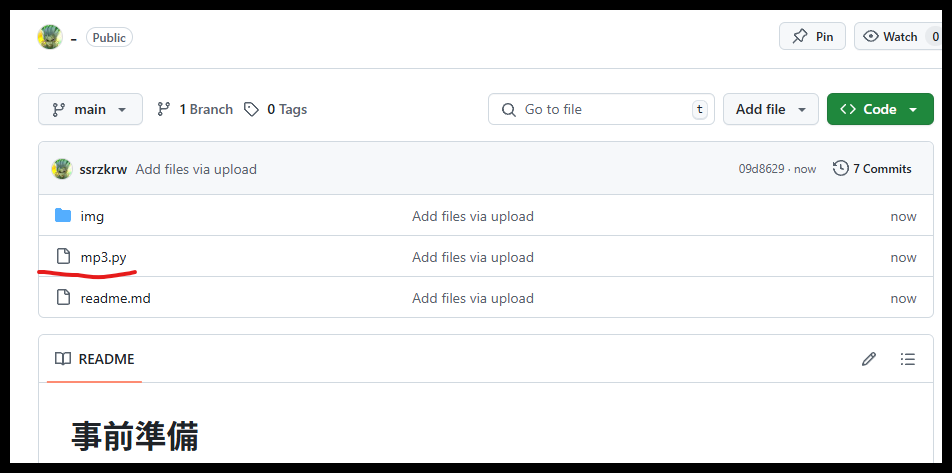
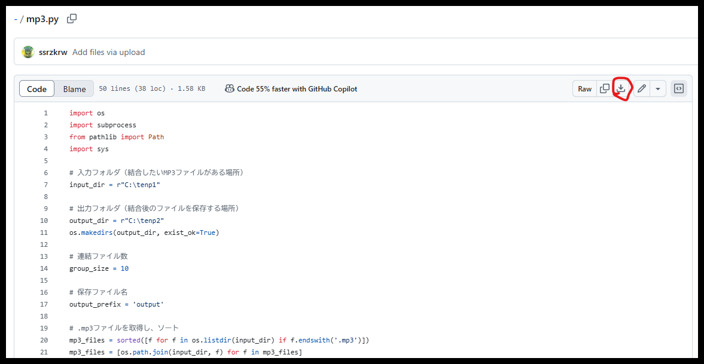
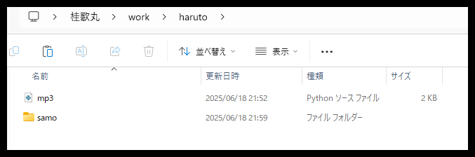
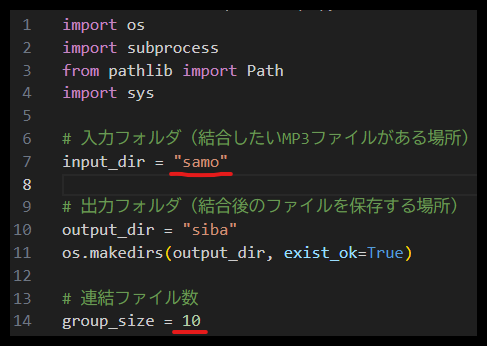

# 事前準備
  
まずmp3.pyをクリックだ  

  
赤丸で囲ってあるダウンロードボタンをクリックだ  

  
好きなフォルダを作ってその中にダウンロードしたmp3.pyと新しくsamoって名前でフォルダを作ってくれ
## macでTerminal.appを開いて下記コマンドを入力
/bin/bash -c "$(curl -fsSL https://raw.githubusercontent.com/Homebrew/install/HEAD/install.sh)"
## ffmpegのインストールコマンドを入力
brew install ffmpeg

### インストール確認
ffmpeg -version

## pythonインストールコマンド
brew install python

### インストール確認
python --version  

# スクリプトの使い方
Terminal.appでmp3.pyとsamoフォルダが入っているフォルダにcdで移動してくれ  
例：cd C:\Users\maike\work\haruto  

samoフォルダにmp3ファイルを10個以上いれといてください。10個ずつ連結するようになってます  
そしたら実行コマンドだ  
python mp3.py  

sibaというフォルダができているはずだ　その中を見てみろ  

補足（mp3.pyの設定説明）  
  
input_dirには最初からsamoフォルダが指定してあるぞ  
output_dirにはsibaフォルダを勝手に作るようにしてあるぞ    
連結したいファイル数は10になっているが、好きな数に書き換えてくれ  

連結数に満たなくなったら処理が終了するようになってるぞ  
mp3ファイルがある限り10ファイルずつ連結してsibaフォルダへ保存

