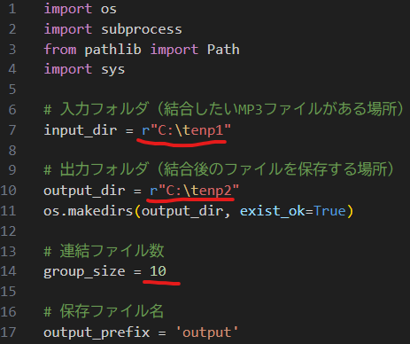

# 事前準備
## Terminal.appを開いて下記コマンドを入力
/bin/bash -c "$(curl -fsSL https://raw.githubusercontent.com/Homebrew/install/HEAD/install.sh)"
## ffmpegのインストールコマンドを入力
brew install ffmpeg

### インストール確認
ffmpeg -version

## pythonインストールリンク
https://www.python.org/ftp/python/3.13.5/python-3.13.5-macos11.pkg

## インストール確認
python --version  

# スクリプトの使い方
  
input_dirに自分のmp3ファイルを格納してるフォルダを指定するんだ  
output_dirに結合したファイルの保存先フォルダを指定するんだ  
最後に連結したいファイル数を指定するんだ  

連結数に満たなくなったら処理が終了するようになってるぞ  
mp3ファイルがある限り10ファイルずつ連結していく

